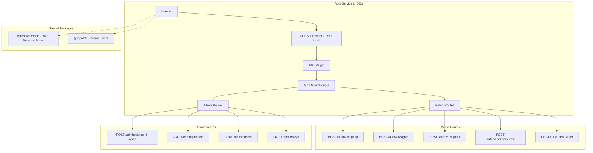
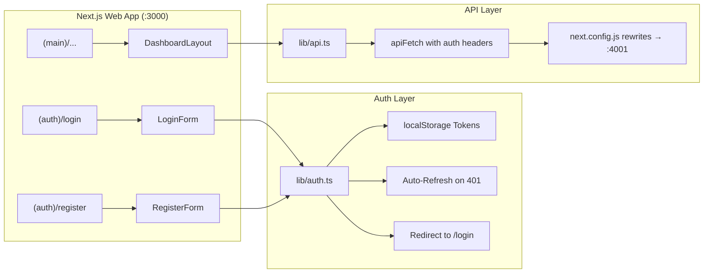

# 🔐 Vorebase Auth System — Full Review Report

## Overall Verdict: ✅ Solid & Well-Architected

The auth system is **production-quality** in terms of architecture and security patterns. There are a few issues to address (noted below), but the fundamentals are strong. Since you've already tested it end-to-end and it works — this report focuses on correctness, completeness, and things to watch out for.

---

## Backend Review

### Architecture Summary

---

### ✅ What's Done Right (Backend)

| Area | Details |
|------|---------|
| **Password Hashing** | bcrypt with 12 salt rounds — industry standard |
| **Timing Attack Prevention** | Dummy bcrypt compare on user-not-found in [signin.ts](file:///c:/Users/riyan/Downloads/bms/apps/auth-service/src/routes/signin.ts#L45-L49) and [admin/auth.ts](file:///c:/Users/riyan/Downloads/bms/apps/auth-service/src/routes/admin/auth.ts#L152-L158) |
| **Email Enumeration Prevention** | Generic error messages: `"Unable to create user"`, `"Invalid email or password"` |
| **Refresh Token Rotation** | Old refresh token immediately revoked on use in [refresh.ts](file:///c:/Users/riyan/Downloads/bms/apps/auth-service/src/routes/refresh.ts#L64-L68) |
| **Token Theft Detection** | Reuse of revoked token triggers mass-revocation of ALL user tokens ([refresh.ts:L46-L57](file:///c:/Users/riyan/Downloads/bms/apps/auth-service/src/routes/refresh.ts#L46-L57)) |
| **Short-lived Access Tokens** | 15 min expiry — correct for security |
| **JWT Secret Validation** | Enforces ≥32 char minimum at startup in [jwt.ts](file:///c:/Users/riyan/Downloads/bms/packages/common/src/jwt.ts#L107-L114) |
| **API Key Security** | SHA-256 hashed, raw key shown only once, prefix stored for UI display |
| **Input Validation** | JSON Schema validation on all endpoints via [auth.schema.ts](file:///c:/Users/riyan/Downloads/bms/apps/auth-service/src/schemas/auth.schema.ts) |
| **Error Handling** | Centralized `AppError` hierarchy with no stack trace leakage to client |
| **Rate Limiting** | 5 req/min per IP on all auth endpoints |
| **RBAC** | Separate admin vs user JWT payloads, `requireAuth` / `requireAdmin` guards |
| **Project Scoped Users** | `@@unique([email, projectId])` — same email can exist in different projects |
| **Cascade Deletes** | Prisma `onDelete: Cascade` on User → RefreshToken, Project → Users/ApiKeys |
| **Plugin Load Order** | Correct: Security → JWT → AuthGuard → Routes |
| **Health Check** | `/auth/v1/health` endpoint present |
| **Cross-Service Auth** | rest-service and storage-service both verify JWT using the same `@repo/common` utilities |

---

### ⚠️ Issues Found (Backend)

#### 1. 🔴 Admin Signup is OPEN — No Access Control

[admin/auth.ts](file:///c:/Users/riyan/Downloads/bms/apps/auth-service/src/routes/admin/auth.ts#L82-L135): `POST /auth/v1/admin/signup` has **no** `preHandler` guard. Anyone can register as a platform admin.

> [!CAUTION]
> This is intentional for dev/bootstrapping, but must be locked down before any deployment. Options:
> - Require an existing admin to create new admins
> - Restrict to a signup invite token / env-based allow-list
> - Disable entirely after first admin creation

#### 2. 🟡 Admin Refresh Token Not Stored in DB

In [admin/auth.ts](file:///c:/Users/riyan/Downloads/bms/apps/auth-service/src/routes/admin/auth.ts#L165-L188), the admin signin generates a `refresh_token` using `fastify.signRefresh()` but **never stores it** in the `RefreshToken` table. The admin refresh endpoint ([L195-L242](file:///c:/Users/riyan/Downloads/bms/apps/auth-service/src/routes/admin/auth.ts#L195-L242)) only verifies the JWT signature — it doesn't check DB-level revocation.

**Impact**: Admin refresh tokens can't be revoked server-side. If an admin token leaks, there's no way to invalidate it short of rotating the JWT_SECRET.

#### 3. 🟡 Admin Refresh Uses `verifyUserToken` Instead of `verifyAdminToken`

In [admin/auth.ts:L209](file:///c:/Users/riyan/Downloads/bms/apps/auth-service/src/routes/admin/auth.ts#L209), the admin token refresh calls `fastify.verifyUserToken(refresh_token)`. This works because both use the same secret, but it's semantically wrong and bypasses type safety. Should use proper refresh token verification.

#### 4. 🟡 Signup Allows No `projectId`

In [signup.ts](file:///c:/Users/riyan/Downloads/bms/apps/auth-service/src/routes/signup.ts#L46-L53), `projectId` is optional. A user can sign up without a project, creating an "orphan" user. The schema marks it optional too. This may be intentional, but orphaned users won't work with the rest of the system (REST, Storage, RLS all require `projectId`).

#### 5. 🟢 `expiresIn` Hardcoded vs. Using Constants

In [signup.ts:L100](file:///c:/Users/riyan/Downloads/bms/apps/auth-service/src/routes/signup.ts#L100) and [signin.ts:L82](file:///c:/Users/riyan/Downloads/bms/apps/auth-service/src/routes/signin.ts#L82): `const expiresIn = 15 * 60` is hardcoded instead of derived from `JWT.ACCESS_TOKEN_EXPIRY`. If you ever change the constant, the response metadata will be wrong. Minor, but a maintenance footgun.

#### 6. 🟢 `additionalProperties: false` Missing on Some Admin Schemas

The inline `adminSignupSchema` and `adminSigninSchema` in [admin/auth.ts](file:///c:/Users/riyan/Downloads/bms/apps/auth-service/src/routes/admin/auth.ts#L37-L75) correctly have `additionalProperties: false`. The admin user update route ([admin/users.ts:L212-L221](file:///c:/Users/riyan/Downloads/bms/apps/auth-service/src/routes/admin/users.ts#L212-L221)) has **no schema validation** — it directly reads `request.body`. Works fine but misses Fastify's built-in validation layer.

---

### API Endpoint Coverage

| Endpoint | Method | Auth | Status |
|----------|--------|------|--------|
| `/auth/v1/signup` | POST | Public | ✅ |
| `/auth/v1/signin` | POST | Public | ✅ |
| `/auth/v1/signout` | POST | `requireAuth` | ✅ |
| `/auth/v1/token/refresh` | POST | Public (validates token) | ✅ |
| `/auth/v1/user` | GET | `requireAuth` | ✅ |
| `/auth/v1/user` | PUT | `requireAuth` | ✅ |
| `/auth/v1/admin/signup` | POST | ⚠️ **Public** | ⚠️ |
| `/auth/v1/admin/signin` | POST | Public | ✅ |
| `/auth/v1/admin/token/refresh` | POST | Public (validates token) | ✅ |
| `/auth/v1/admin/projects` | GET/POST | `requireAdmin` | ✅ |
| `/auth/v1/admin/projects/:id` | GET/PUT/DELETE | `requireAdmin` | ✅ |
| `/auth/v1/admin/users` | GET/POST | `requireAdmin` | ✅ |
| `/auth/v1/admin/users/:id` | GET/PUT/DELETE | `requireAdmin` | ✅ |
| `/auth/v1/admin/keys` | GET/POST | `requireAdmin` | ✅ |
| `/auth/v1/admin/keys/:id` | DELETE | `requireAdmin` | ✅ |
| `/auth/v1/health` | GET | Public | ✅ |

---

## Frontend Review

### Architecture Summary

### ✅ What's Done Right (Frontend)

| Area | Details |
|------|---------|
| **Auth Token Storage** | Properly stored in localStorage with clear helper functions |
| **Auto-Refresh** | 401 response triggers `refreshAdminToken()` before redirecting |
| **De-dupe Refresh** | Concurrent refresh calls are de-duplicated via mutex ([auth.ts:L79-L131](file:///c:/Users/riyan/Downloads/bms/apps/web/lib/auth.ts#L79-L131)) |
| **Auth Headers** | Centralized `authHeaders()` function used by all API calls |
| **Login Flow** | Stores access_token, refresh_token, and admin user info |
| **Registration** | Password confirmation + strength indicator |
| **Password Strength Bar** | Visual 4-level indicator (Weak/Fair/Good/Strong) |
| **Error Display** | All auth forms show inline errors with proper styling |
| **Loading States** | Spinner during sign-in/register prevents double-submit |
| **API Proxy** | `next.config.js` rewrites eliminate CORS issues |
| **Admin User CRUD** | Full CRUD for project users: list, create, update, delete |
| **User Table** | Rich display with avatar initials, role badges, last sign-in time |
| **RLS Policies** | Policy management UI with enable/disable toggles |

### ⚠️ Issues Found (Frontend)

#### 1. 🔴 No Route Protection on Dashboard Pages

The `(main)/layout.tsx` ([layout.tsx](file:///c:/Users/riyan/Downloads/bms/apps/web/app/(main)/layout.tsx)) renders `{children}` directly — **no auth guard**. An unauthenticated user can navigate to `/projects` and the page will load (API calls fail silently or redirect late).

> [!IMPORTANT]
> Should add a client-side auth check in the main layout that redirects to `/login` if no token exists. Example: check `isAuthenticated()` on mount, redirect if false.

#### 2. 🟡 OAuth Buttons Are Non-Functional (UI Only)

[oauth-buttons.tsx](file:///c:/Users/riyan/Downloads/bms/apps/web/components/auth/oauth-buttons.tsx): Google and GitHub buttons exist but have no `onClick` handler. They're purely visual. This is fine if you plan to add OAuth later, but could confuse users clicking them and getting no response.

#### 3. 🟡 "Forgot Password?" Link Goes Nowhere

In [login-form.tsx:L90-L92](file:///c:/Users/riyan/Downloads/bms/apps/web/components/auth/login-form.tsx#L90-L92): `<a href="#">Forgot password?</a>` — the link is a dead `#` anchor. No backend endpoint for password reset exists either.

#### 4. 🟡 Error Parsing in `adminLogin` Doesn't Match Backend Shape

The `adminLogin` function in [api.ts:L179-L181](file:///c:/Users/riyan/Downloads/bms/apps/web/lib/api.ts#L179-L181) tries `body.message || body.error`. But the backend error format (from `AppError.toJSON()`) uses `body.error.message`. So login errors may fall through to the generic `"Invalid email or password"` fallback rather than showing the actual error.

**Fix**: `body.error?.message || body.message || "Invalid email or password"`

#### 5. 🟢 Delete User Action Not Wired in `users-view.tsx`

The `UsersView` component passes no `onDeleteUser` prop to `UserTable` — the delete button exists but calling it invokes `onDeleteUser?.(user.id)` which is undefined.

#### 6. 🟢 No Logged-in User Redirect on Auth Pages

When a user is already logged in and visits `/login` or `/register`, there's no redirect to `/projects`. They can re-login and overwrite their existing session.

---

## Component Inventory

### Backend Files (Auth Service)

| File | Purpose | Lines | Status |
|------|---------|-------|--------|
| [index.ts](file:///c:/Users/riyan/Downloads/bms/apps/auth-service/src/index.ts) | Server bootstrap, plugin + route registration | 154 | ✅ |
| [jwt.ts](file:///c:/Users/riyan/Downloads/bms/apps/auth-service/src/plugins/jwt.ts) | JWT sign/verify decorators | 84 | ✅ |
| [auth-guard.ts](file:///c:/Users/riyan/Downloads/bms/apps/auth-service/src/plugins/auth-guard.ts) | `requireAuth` / `requireAdmin` hooks | 119 | ✅ |
| [auth.schema.ts](file:///c:/Users/riyan/Downloads/bms/apps/auth-service/src/schemas/auth.schema.ts) | JSON Schema validation | 141 | ✅ |
| [signup.ts](file:///c:/Users/riyan/Downloads/bms/apps/auth-service/src/routes/signup.ts) | User registration | 124 | ✅ |
| [signin.ts](file:///c:/Users/riyan/Downloads/bms/apps/auth-service/src/routes/signin.ts) | User login | 106 | ✅ |
| [signout.ts](file:///c:/Users/riyan/Downloads/bms/apps/auth-service/src/routes/signout.ts) | Session revocation | 39 | ✅ |
| [refresh.ts](file:///c:/Users/riyan/Downloads/bms/apps/auth-service/src/routes/refresh.ts) | Token rotation | 107 | ✅ |
| [user.ts](file:///c:/Users/riyan/Downloads/bms/apps/auth-service/src/routes/user.ts) | GET/PUT current user | 111 | ✅ |
| [admin/auth.ts](file:///c:/Users/riyan/Downloads/bms/apps/auth-service/src/routes/admin/auth.ts) | Admin signup/signin/refresh | 245 | ⚠️ |
| [admin/projects.ts](file:///c:/Users/riyan/Downloads/bms/apps/auth-service/src/routes/admin/projects.ts) | Project CRUD | 327 | ✅ |
| [admin/users.ts](file:///c:/Users/riyan/Downloads/bms/apps/auth-service/src/routes/admin/users.ts) | Admin user management | 344 | ✅ |
| [admin/keys.ts](file:///c:/Users/riyan/Downloads/bms/apps/auth-service/src/routes/admin/keys.ts) | API key management | 176 | ✅ |

### Shared Package Files

| File | Purpose | Status |
|------|---------|--------|
| [jwt.ts](file:///c:/Users/riyan/Downloads/bms/packages/common/src/jwt.ts) | Sign, verify, decode JWT helpers | ✅ |
| [security.ts](file:///c:/Users/riyan/Downloads/bms/packages/common/src/security.ts) | bcrypt, API key gen, timing-safe compare | ✅ |
| [constants.ts](file:///c:/Users/riyan/Downloads/bms/packages/common/src/constants.ts) | JWT, security, rate limit constants | ✅ |
| [errors.ts](file:///c:/Users/riyan/Downloads/bms/packages/common/src/errors.ts) | AppError hierarchy | ✅ |
| [types.ts](file:///c:/Users/riyan/Downloads/bms/packages/common/src/types.ts) | JwtPayload, AdminJwtPayload, AuthTokens | ✅ |

### Frontend Files

| File | Purpose | Status |
|------|---------|--------|
| [auth.ts](file:///c:/Users/riyan/Downloads/bms/apps/web/lib/auth.ts) | Token storage, refresh, redirect | ✅ |
| [api.ts](file:///c:/Users/riyan/Downloads/bms/apps/web/lib/api.ts) | `adminLogin`, `adminRegister`, all API calls | ⚠️ (error parsing) |
| [login-form.tsx](file:///c:/Users/riyan/Downloads/bms/apps/web/components/auth/login-form.tsx) | Login UI | ✅ |
| [register-form.tsx](file:///c:/Users/riyan/Downloads/bms/apps/web/components/auth/register-form.tsx) | Registration UI | ✅ |
| [oauth-buttons.tsx](file:///c:/Users/riyan/Downloads/bms/apps/web/components/auth/oauth-buttons.tsx) | OAuth buttons (Google, GitHub) | 🟡 UI only |
| [password-strength.tsx](file:///c:/Users/riyan/Downloads/bms/apps/web/components/auth/password-strength.tsx) | Password strength indicator | ✅ |
| [users-view.tsx](file:///c:/Users/riyan/Downloads/bms/apps/web/components/auth/users-view.tsx) | User list management | ✅ |
| [user-table.tsx](file:///c:/Users/riyan/Downloads/bms/apps/web/components/auth/user-table.tsx) | User table display | 🟡 (delete not wired) |
| [create-user-modal.tsx](file:///c:/Users/riyan/Downloads/bms/apps/web/components/auth/create-user-modal.tsx) | Add user modal | ✅ |
| [policies-view.tsx](file:///c:/Users/riyan/Downloads/bms/apps/web/components/auth/policies-view.tsx) | RLS policy management | ✅ |
| [auth-layout.tsx](file:///c:/Users/riyan/Downloads/bms/apps/web/components/layouts/auth-layout.tsx) | Auth page layout wrapper | ✅ |

---

## Priority Fix List

| # | Severity | What | Where |
|---|----------|------|-------|
| 1 | 🔴 **Critical** | Lock down admin signup | [admin/auth.ts](file:///c:/Users/riyan/Downloads/bms/apps/auth-service/src/routes/admin/auth.ts#L82-L135) |
| 2 | 🔴 **Critical** | Add route guard to dashboard layout | [layout.tsx](file:///c:/Users/riyan/Downloads/bms/apps/web/app/(main)/layout.tsx) |
| 3 | 🟡 **Medium** | Store admin refresh tokens in DB | [admin/auth.ts](file:///c:/Users/riyan/Downloads/bms/apps/auth-service/src/routes/admin/auth.ts#L172) |
| 4 | 🟡 **Medium** | Fix error parsing in `adminLogin` | [api.ts:L181](file:///c:/Users/riyan/Downloads/bms/apps/web/lib/api.ts#L181) |
| 5 | 🟡 **Medium** | Wire up delete user action | [users-view.tsx](file:///c:/Users/riyan/Downloads/bms/apps/web/components/auth/users-view.tsx) |
| 6 | 🟢 **Low** | Use `JWT.ACCESS_TOKEN_EXPIRY` for `expires_in` | [signup.ts:L100](file:///c:/Users/riyan/Downloads/bms/apps/auth-service/src/routes/signup.ts#L100) |
| 7 | 🟢 **Low** | Add schema validation to admin user update | [admin/users.ts:L212](file:///c:/Users/riyan/Downloads/bms/apps/auth-service/src/routes/admin/users.ts#L212) |
| 8 | 🟢 **Low** | Redirect logged-in users away from /login | [login-form.tsx](file:///c:/Users/riyan/Downloads/bms/apps/web/components/auth/login-form.tsx) |

---

## Missing Features (Not Bugs)

These are things you may want to add eventually but are not broken:

- **Password reset flow** (endpoint + email)
- **Email verification / confirmation**
- **OAuth integration** (backend endpoints for Google/GitHub)
- **Account lockout** after X failed attempts
- **Session listing** (show user their active sessions)
- **Admin audit log** (track admin actions)
- **CSRF protection** (not needed for API-only, but consider for cookie-based auth)

---

## Summary

The auth backend is **well-engineered** with strong security practices (timing attack prevention, refresh token rotation, token theft detection). The frontend has proper session management with auto-refresh. The main concerns are:

1. **Admin signup being open** — needs a guard for anything beyond local dev
2. **No client-side route protection** — dashboard pages accessible without auth
3. **Admin refresh tokens not DB-tracked** — can't be revoked

Everything else is solid. The code is clean, well-documented, and follows industry best practices. 🎯
